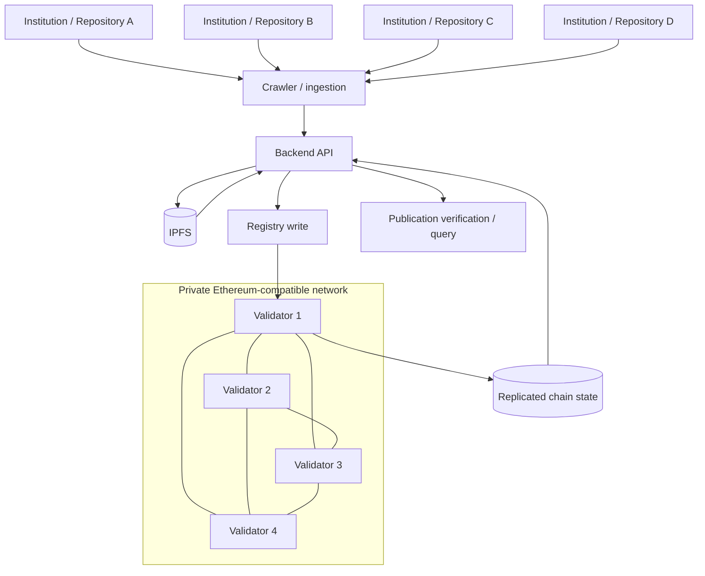
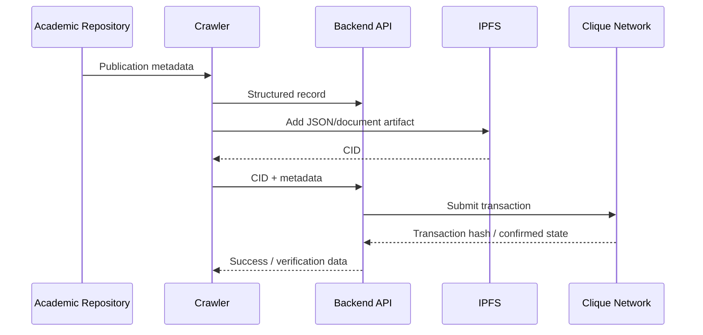

# Architecture

## System boundary

The project combines a permissioned blockchain network with an academic-publication ingestion workflow.

## Layer 1 - Validator network

Each VM acts as a Geth full node and validator in the academic lab.

Responsibilities include:

- participating in the P2P network;
- validating / sealing blocks under Clique PoA;
- replicating chain state;
- exposing controlled RPC access for the application layer.

## Layer 2 - Shared genesis

Every node must use the same genesis configuration:

- chain ID;
- Clique configuration;
- initial validator set encoded in `extradata`;
- initial balances;
- protocol fork activation settings.

The genesis block is effectively the **network contract** for chain identity. Even a one-character mismatch means nodes initialize different chains.

## Layer 3 - Application API

The report documents a backend API that receives publication data and submits blockchain writes.

The API acts as a boundary between:

- crawler / ingestion logic;
- IPFS content addressing;
- blockchain transaction submission;
- record lookup / verification.

## Layer 4 - Off-chain storage

The workflow uses IPFS for the JSON/document artifact and stores a reference such as a CID alongside integrity / publication metadata.

This is preferable to putting large raw documents directly into chain state.

## Data flow

## Why this is a distributed-systems project

The interesting problems are not only blockchain-specific. The system also depends on:

- consistent distributed configuration;
- peer discovery and connectivity;
- replicated state;
- authority quorum;
- eventual block confirmation;
- off-chain/on-chain data boundaries;
- application-level retry and verification behavior.

## Production evolution

A production consortium implementation would need stronger identity lifecycle, key custody, observability, RPC isolation, automated node provisioning, backup/recovery, contract upgrade governance, and member onboarding/offboarding procedures.
