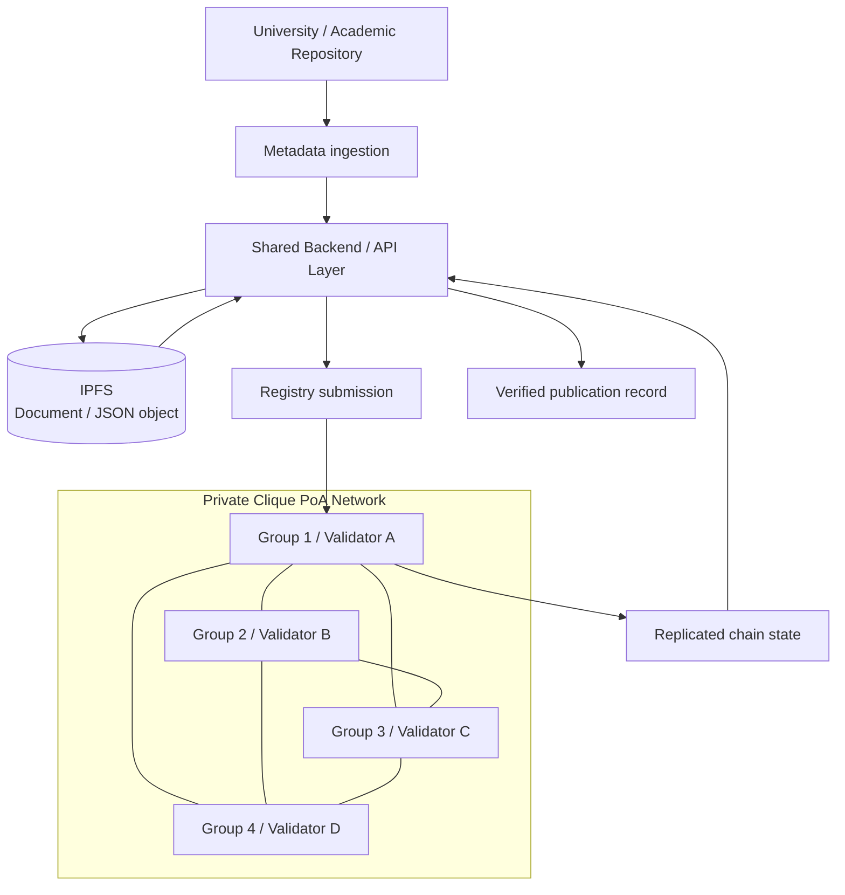
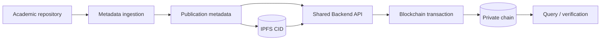

# Private Blockchain for Academic Publication Registry

[](./ARCHITECTURE.md)
[](./NETWORK.md)
[](./THESIS_PIPELINE.md)
[](./scripts/validate_genesis.py)
[](./PORTFOLIO.md)

A recruiter-facing case study of a **class-wide collaborative distributed-systems assignment** for registering academic-publication metadata on a permissioned Ethereum-compatible network.

The **system specification and cross-group responsibility split were provided by the course lecturer** in the upstream case definition:

- https://github.com/3k0sakti/SKT/blob/main/case/case-B.md

The class then implemented and operated the design across **4 cooperating groups / validator VMs**. This repository preserves the **Group 1 implementation evidence** and documents the resulting end-to-end system without claiming that the original architecture was independently invented by the student team.

> **Portfolio owner context:** Syifani Adillah Salsabila was the Group 1 PIC / VM-1 contact named in the course specification. Group 1's primary cross-group responsibility was to create and distribute `genesis.json` and coordinate the initial network setup, while all groups also operated a validator, submitted publication data, and participated in consensus.

> **Portfolio note:** infrastructure addresses, passwords, bootnode identifiers, and other course-lab details are intentionally removed from recruiter-facing documentation.

## What was specified vs implemented

### Upstream course specification

The lecturer-provided case defines the overall system, including:

- consortium/private Ethereum network;
- 4 validator groups;
- Clique Proof-of-Authority;
- cross-university thesis/publication sources;
- smart-contract registry;
- REST API and plagiarism workflow;
- IPFS-backed storage;
- cross-group testing and node-failure scenarios.

### Class / Group 1 implementation evidence

The student work documented in this repository/report includes:

- validator account setup;
- shared genesis construction and distribution;
- Clique signer configuration;
- Geth chain initialization;
- P2P bootstrap and peer verification;
- block-production verification;
- Group 1 publication ingestion from the assigned Undip source;
- use of the shared backend/API, contract, and IPFS workflow produced across the class collaboration;
- transaction submission and record verification.

This distinction matters: **the course case supplied the architecture and responsibilities; the students implemented, integrated, operated, tested, and documented it.**

## Why this project is useful portfolio evidence

The engineering work goes beyond running a single smart contract. The class-wide system requires several distributed-systems layers to work together:

- multiple validator/full nodes;
- deterministic shared genesis state;
- P2P peer discovery / bootstrapping;
- authority-based block production;
- signer coordination;
- off-chain content storage through IPFS;
- backend transaction submission;
- post-write verification through chain state / API retrieval.

## Architecture



The high-level architecture above follows the lecturer-provided case specification and is supported by the implementation report. See [ARCHITECTURE.md](./ARCHITECTURE.md).

## Group responsibilities defined by the case

| Group | Primary responsibility | Shared responsibility |
|---|---|---|
| **K1 / Syifani** | Create + distribute `genesis.json`; coordinate initial setup | Operate validator, submit Undip records, join consensus |
| K2 | Configure / deploy smart contract | Operate validator, submit IPB records, join consensus |
| K3 | Build REST API + plagiarism engine | Operate validator, submit UB records, join consensus |
| K4 | Build OAI-PMH crawler + IPFS storage pipeline | Operate validator, submit Unhas records, join consensus |

The upstream specification explicitly notes that all groups were still expected to understand and operate the complete system on their side.

## Network design

The documented lab uses **Geth v1.13.15** and Clique PoA with a shared `genesis.json`.

The retained Group 1 configuration defines:

```text
chainId      : 20260315
consensus    : Clique PoA
block period : 5 seconds
clique epoch : 30000
gas limit    : 8,000,000
validators   : 4 in the retained genesis artifact
```

Every participating node must initialize from the **same genesis file**. A genesis mismatch creates a different chain and prevents correct peering.

The retained [`genesis.json`](./genesis.json) contains public validator addresses from the academic lab. A placeholder-based example for reuse is available at [`genesis.example.json`](./genesis.example.json).

See [NETWORK.md](./NETWORK.md).

## Executable genesis consistency check

Because Group 1's primary responsibility included constructing and distributing the shared genesis, the repository now includes an executable structural validator instead of relying only on prose documentation.

[`scripts/validate_genesis.py`](./scripts/validate_genesis.py) checks the retained artifact for:

- expected `chainId`, Clique period, epoch, difficulty, and gas limit;
- valid Clique `extraData` framing;
- exactly four 20-byte signer addresses;
- duplicate signer detection;
- signer-set equality with the funded validator allocation; and
- syntactically valid validator addresses with positive genesis balances.

GitHub Actions runs this check on pushes and pull requests through [`.github/workflows/genesis-validation.yml`](./.github/workflows/genesis-validation.yml).

> This CI validates the **retained configuration artifact**. It does not claim that a live four-node network is currently running or that consensus availability is being tested in CI.

## Validation performed

The implementation report verifies the network using checks such as:

```text
peer count          -> expected validator connectivity
clique signers      -> expected authority set
block number        -> continues increasing
node logs           -> no blocking consensus/peering error
```

The important engineering point is that **block creation, validator identity, and peer connectivity must all agree on the same chain configuration**.

## Academic-publication pipeline

The lecturer specification defines a class-wide application workflow, and the implementation report demonstrates the Group 1 side using the integrated components:



The report records an end-to-end flow that:

1. obtains thesis/publication metadata;
2. produces a structured JSON artifact;
3. uploads the artifact to IPFS;
4. submits publication data through the shared backend API;
5. receives transaction hashes;
6. verifies that the block height increases;
7. retrieves the stored record through an API backed by blockchain state.

See [THESIS_PIPELINE.md](./THESIS_PIPELINE.md).

## Repository navigation

| Area | Document |
|---|---|
| System architecture | [ARCHITECTURE.md](./ARCHITECTURE.md) |
| Validator network / Clique PoA | [NETWORK.md](./NETWORK.md) |
| Thesis/publication ingestion pipeline | [THESIS_PIPELINE.md](./THESIS_PIPELINE.md) |
| Genesis invariant validator | [scripts/validate_genesis.py](./scripts/validate_genesis.py) |
| Security considerations | [SECURITY.md](./SECURITY.md) |
| Limitations / non-claims | [LIMITATIONS.md](./LIMITATIONS.md) |
| Source / report evidence | [SOURCE_EVIDENCE.md](./SOURCE_EVIDENCE.md) |
| Team + class attribution | [TEAM_ATTRIBUTION.md](./TEAM_ATTRIBUTION.md) |
| Recruiter / CV summary | [PORTFOLIO.md](./PORTFOLIO.md) |
| Reusable genesis template | [genesis.example.json](./genesis.example.json) |

## Security note

The original coursework used a controlled lab and included commands convenient for experimentation. They should **not** be copied directly into a production Ethereum deployment.

A production design should avoid practices such as exposing broad RPC modules, permissive CORS, insecure account unlocking, plaintext password files, or unrestricted network interfaces.

See [SECURITY.md](./SECURITY.md).

## Attribution

There are **two collaboration levels** in this project:

1. **Class-wide:** four groups jointly implemented one network from a lecturer-provided case design.
2. **Group 1:** Syifani and her teammates implemented/operated the Group 1 node and documented their side of the integration.

This portfolio does not claim authorship of the lecturer's assignment design or sole authorship of the components assigned to the other groups.

See [TEAM_ATTRIBUTION.md](./TEAM_ATTRIBUTION.md) and [SOURCE_EVIDENCE.md](./SOURCE_EVIDENCE.md).

---

**Portfolio owner:** [Syifani Adillah Salsabila](https://github.com/syifaniads)  
**Role shown by upstream case:** Group 1 PIC / VM-1 coordination  
**Project type:** Collaborative Distributed Systems / Private Blockchain coursework  
**Context:** Universitas Brawijaya - 2026
