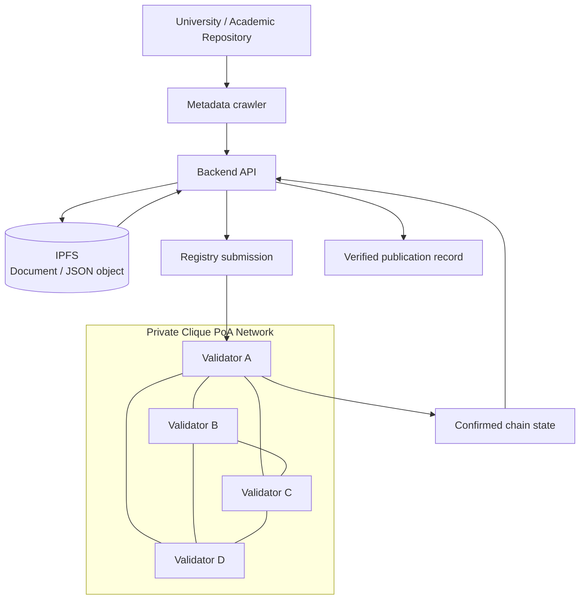
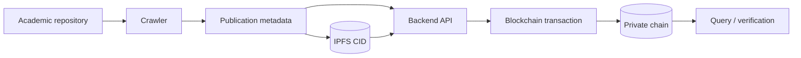

# Private Blockchain for Academic Publication Registry

[](./ARCHITECTURE.md)
[](./NETWORK.md)
[](./THESIS_PIPELINE.md)
[](./PORTFOLIO.md)

A collaborative distributed-systems project that builds a **permissioned Ethereum-compatible network** for registering academic-publication metadata across multiple validator nodes.

The coursework combines **Geth**, **Clique Proof-of-Authority**, multi-VM peer networking, a shared genesis configuration, backend API integration, repository crawling, **IPFS**, and blockchain transaction verification.

> **Portfolio note:** this repository is a curated public presentation of an academic team project. Infrastructure addresses, passwords, bootnode identifiers, and other course-lab details are intentionally removed from the recruiter-facing documentation.

## Why this project is interesting

The project is more than a basic smart-contract demo. It requires several distributed-systems layers to work together:

- multiple validator/full nodes;
- deterministic shared genesis state;
- P2P peer discovery / bootstrapping;
- authority-based block production;
- node quorum / signer coordination;
- off-chain document storage through IPFS;
- backend ingestion and transaction submission;
- post-write verification through chain state / API retrieval.

## Architecture



See [ARCHITECTURE.md](./ARCHITECTURE.md).

## Network design

The documented lab uses **Geth v1.13.15** and Clique PoA with a shared `genesis.json`.

The original configuration defines:

```text
chainId      : 20260315
consensus    : Clique PoA
block period : 5 seconds
clique epoch : 30000
gas limit    : 8,000,000
validators   : 4 in the retained genesis artifact
```

Every participating node must initialize from the **same genesis file**. A genesis mismatch creates a different chain and prevents correct peering.

The retained [`genesis.json`](./genesis.json) contains public validator addresses from the academic lab. A placeholder-based example for reuse is available at [`genesis.example.json`](./genesis.example.json).

See [NETWORK.md](./NETWORK.md).

## Validation performed

The course report verifies the network using checks such as:

```text
peer count          -> expected validator connectivity
clique signers      -> expected authority set
block number        -> continues increasing
node logs           -> no blocking consensus/peering error
```

The important engineering point is that **block creation, validator identity, and peer connectivity must all agree on the same chain configuration**.

## Academic-publication pipeline

The project extends the network with an application workflow:



The final report records an end-to-end flow that:

1. crawls thesis/publication metadata;
2. produces a structured JSON artifact;
3. uploads the artifact to IPFS;
4. submits publication data through the backend API;
5. receives transaction hashes;
6. verifies that the block height increases;
7. retrieves the stored record through an API backed by blockchain state.

See [THESIS_PIPELINE.md](./THESIS_PIPELINE.md).

## Why IPFS + blockchain

The project separates two responsibilities:

- **IPFS / object content** - store larger content or content-addressed artifacts off-chain;
- **blockchain state** - store integrity/reference metadata and an immutable transaction history.

This avoids placing full documents directly into blockchain state while still giving the application a verifiable reference path.

## Repository navigation

| Area | Document |
|---|---|
| System architecture | [ARCHITECTURE.md](./ARCHITECTURE.md) |
| Validator network / Clique PoA | [NETWORK.md](./NETWORK.md) |
| Thesis/publication ingestion pipeline | [THESIS_PIPELINE.md](./THESIS_PIPELINE.md) |
| Security considerations | [SECURITY.md](./SECURITY.md) |
| Limitations / non-claims | [LIMITATIONS.md](./LIMITATIONS.md) |
| Source / report evidence | [SOURCE_EVIDENCE.md](./SOURCE_EVIDENCE.md) |
| Team attribution | [TEAM_ATTRIBUTION.md](./TEAM_ATTRIBUTION.md) |
| Recruiter / CV summary | [PORTFOLIO.md](./PORTFOLIO.md) |
| Reusable genesis template | [genesis.example.json](./genesis.example.json) |

## Security note

The original coursework used a controlled lab and included commands convenient for experimentation. They should **not** be copied directly into a production Ethereum deployment.

A production design should avoid practices such as exposing broad RPC modules, permissive CORS, insecure account unlocking, plaintext password files, or unrestricted network interfaces.

See [SECURITY.md](./SECURITY.md).

## Attribution

This project was completed collaboratively by a six-person student team. This repository is maintained as personal portfolio evidence and does not claim sole authorship of all implementation work.

See [TEAM_ATTRIBUTION.md](./TEAM_ATTRIBUTION.md).

---

**Portfolio owner:** [Syifani Adillah Salsabila](https://github.com/syifaniads)  
**Project type:** Collaborative Distributed Systems / Private Blockchain coursework  
**Context:** Universitas Brawijaya - 2026
