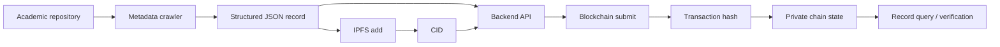

# Academic Publication Ingestion Pipeline

## Objective

The application layer explores how thesis/publication metadata can be collected from an academic repository, associated with content-addressed storage, and registered on a private blockchain for later verification.

## End-to-end flow



## 1. Crawl / ingest metadata

The final report documents a crawler that gathers thesis/publication metadata from a university repository and converts it into structured records.

The portfolio does not mirror the original target URL or lab-specific configuration because they are not necessary to demonstrate the architecture.

## 2. Store content off-chain

The workflow uploads the generated JSON/document artifact to IPFS and receives a CID.

Conceptually:

```bash
ipfs add <PUBLICATION_ARTIFACT>
```

Output:

```text
<CID>
```

The CID can then be stored or referenced by the blockchain record.

## 3. Submit registry data

The course report documents a backend endpoint that submits publication records into the blockchain workflow.

Conceptually:

```http
POST /api/v1/blockchain/submit
```

Successful submissions return transaction hashes, providing evidence that write requests were sent to the private chain.

## 4. Verify chain progress

The report compares the block height before and after submission and observes that the chain continues producing blocks while the transactions are processed.

This is useful as a basic operational check, although a production application should verify **transaction receipts / confirmation status**, not infer success from block height alone.

## 5. Query stored publication data

The report also documents a thesis lookup API that returns structured publication data including fields such as:

- document hash;
- similarity-related metadata;
- IPFS CID;
- title;
- author/institution metadata;
- program/year/keywords;
- timestamp/status.

The public portfolio intentionally avoids copying the original sample record verbatim because some identifiers are only useful inside the coursework environment.

## On-chain vs off-chain boundary

A sensible registry design separates:

### On-chain

- immutable identifier / hash;
- CID or content reference;
- institution / status metadata;
- timestamp / provenance information.

### Off-chain

- large document bytes;
- crawl output;
- richer metadata not required for consensus;
- privacy-sensitive content.

## Integrity model

A stronger production workflow would calculate a content hash locally and verify that:

```text
hash(downloaded IPFS object) == hash committed to chain
```

This creates an explicit integrity path between off-chain content and blockchain state.

## Production improvements

For a real academic registry, additional concerns include:

- canonical record schemas;
- duplicate / revision handling;
- publisher or university identity verification;
- privacy rules for student records;
- IPFS pinning / durability;
- smart-contract access control;
- transaction idempotency;
- retry handling;
- chain reorganization / confirmation policy;
- data-retention and takedown governance.
